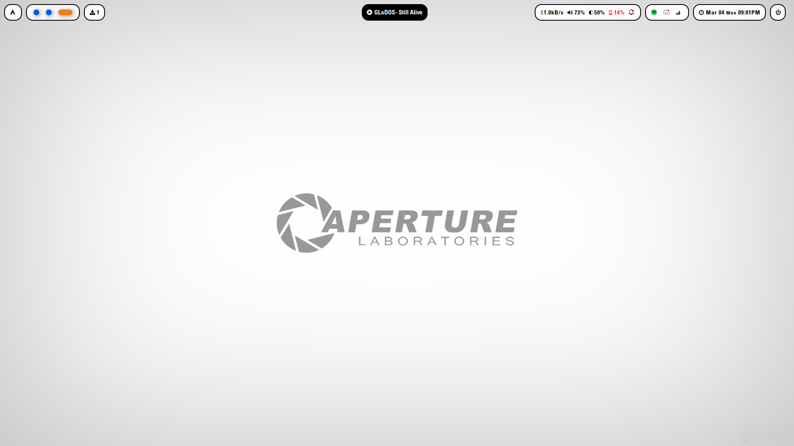

# Welcome to Aperture Labratories
A collection of configuration files for my Apeture Labratories rice

```
╭─ Distro  -> Arch x86_64
├─ Browser -> Firefox
├─ Shell   -> ZSH
╰─ Resource Monitor -> btop++

╭─ Model -> Dell Latitude 7490
├─ CPU   -> Intel Core i7-8650U @ 1.90GHz
╰─ Resolution -> 1920x1080

╭─ WM       -> Hyprland
├─ Terminal -> Kitty
├─ Dock	 -> Waybar
├─ Theme    -> Skeuos-Blue-Light
├─ Icons    -> HighContrast
╰─ Font     -> Hack Nerd Font / Univers
```
[]